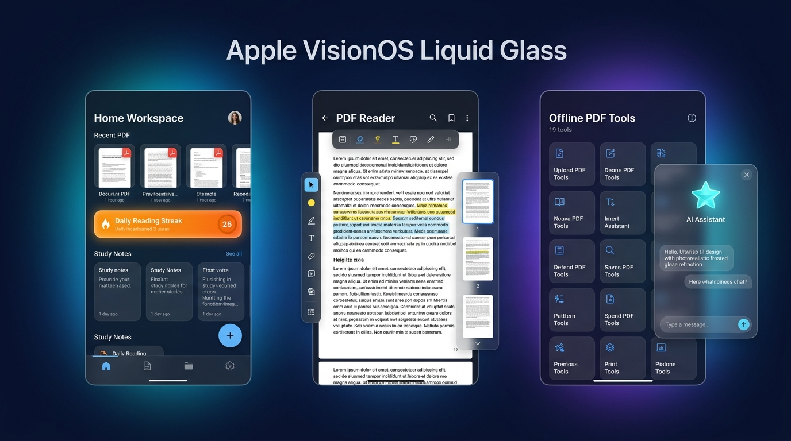
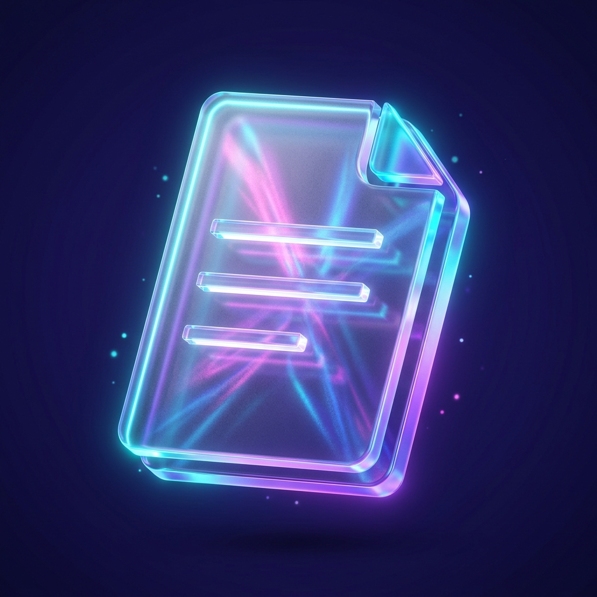

<div align="center">


# **Paperflow — PDF Reader, Toolkit & Notes**

### **High-Refresh Liquid Glass PDF Reader • 20 PDF Utilities • Universal AI Translator • Linked Study Notes**

*A modern, local-first Android PDF Reader, Document Studio, Universal Language Translator, and Study Notes workspace crafted with **Kotlin**, **Jetpack Compose**, and an **Apple VisionOS-inspired Liquid Glass** design system.*

<br/>

[-238636?style=for-the-badge&logo=android&logoColor=white)](#-quick-start--local-build)
[](#-architecture--project-structure)
[](#-app-interface--visual-showcase)
[](#-20-built-in-pdf-tools--universal-translator)
[](#-performance--engineering-highlights)
[](LICENSE)

<br/>

[**📸 Visual Tour**](#-app-interface--visual-showcase) • [**✨ Key Features**](#-core-workspace-modules) • [**🛠️ 20 PDF Tools**](#-20-built-in-pdf-tools--universal-translator) • [**🎨 6 Visual Themes**](#-visual-editions--bespoke-photo-themes) • [**🏗️ Architecture**](#-architecture--project-structure) • [**🚀 Build APK**](#-quick-start--local-build)

</div>

---

## 📸 App Interface & Visual Showcase

<div align="center">
  
  <p><em><b>Left:</b> Home Workspace, Continue Reading Carousel & 🔥 Daily Streak • <b>Center:</b> High-Resolution PDF Reader & 5-Color Annotation Studio • <b>Right:</b> 20 Built-In PDF Tools & Draggable Liquid-Glass AI Assistant</em></p>
</div>

---

## 🎨 Visual Editions & Bespoke Photo Themes

Paperflow features **6 curated visual editions** configurable in **Settings → Appearance**, combining frosted translucent glassmorphism with bespoke high-resolution studio artwork:

| 💎 VisionOS Liquid Glass | 🌌 Galactic Scholar (Cosmic Codex) | 🏜️ Desert Dune (Warm Terracotta) | 🌲 Enchanted Forest (Botanical) |
| :---: | :---: | :---: | :---: |
|  |  |  |  |
| **Default Liquid Glass**<br/>Frosted translucent layers, specular highlights & cyan/indigo refraction. | **Galactic Scholar Edition**<br/>Deep-space midnight obsidian & warm gold illumination. | **Desert Dune Edition**<br/>Sun-baked terracotta clay, warm sandstone & amber bronze accents. | **Enchanted Forest Edition**<br/>Deep woodland pine, emerald moss & sunlit botanical gold. |

> **Plus Classic Modes:** Seamlessly switch between **Light**, **Dark (AMOLED)**, and **System Adaptive** modes at any time.

---

## 🖥️ Core Workspace Modules

Paperflow is engineered around a **Safe-Area Floating Liquid Glass Navigation Bar** and full-screen interactive studios:

### 1. 🏠 Home Workspace & Daily Reading Streak (`HomeScreen.kt`)
- **Hero Banner & 1-Tap Quick Actions**: Instant access to **Open PDF** (Android Storage Access Framework), **Translate PDF**, **Merge PDF**, **Split PDF**, **Compress**, and **New Study Note**.
- **Snapchat-Style Streak Pill (`🔥 + count`)**: Integrated in the top header bar; tapping opens the full **Daily Reading Streak** celebration modal and 7-day check-in calendar strip.
- **Google Play Store–Style Transparent Pull-to-Refresh**: Pull down anywhere on **Home**, **Tools**, **Library**, or **Settings** to trigger an organic multi-color morphing indicator over a 100% transparent background.
- **Continue Reading Carousel**: Displays your most recently opened PDF documents with live reading progress bars, page counters, and last-read timestamps.

### 2. 📖 Native PDF Reader & Annotation Studio (`PdfReaderScreen.kt`)
- **Crisp Multi-Page Rendering**: Powered by Android's native `android.graphics.pdf.PdfRenderer` with `Mutex`-synchronized bitmap rendering and `LruCache` page thumbnail caching.
- **Fluid Gestures**: Pinch-to-zoom (`1.0x` to `4.0x`), double-tap zoom toggle, vertical/horizontal page scrolling, fit-to-width reset, and interactive bottom thumbnail scrubber.
- **Reader Color Filters**: Switch effortlessly between **Light**, **Sepia (Warm Paper)**, and **Dark (AMOLED Night)** reading filters.
- **Persistent Annotation Studio**: Draw and save **Highlight**, **Underline**, **Strikethrough**, **Pen**, **Marker**, **Sticky Text Notes**, and **Eraser** strokes in **Yellow**, **Green**, **Blue**, **Pink**, and **Purple**.

### 3. ✨ Draggable Floating Liquid-Glass AI Assistant (`FloatingAiChatbot.kt`)
- **Bespoke Animated Prism Star Logo**: Features counter-rotating cyan, electric-blue, and violet orbital rings with a breathing crystalline star core.
- **Smooth Drag & 4-Edge Magnetic Snap**: Drag the floating orb anywhere on screen with safe-area inset clamping and spring physics that snap cleanly to the nearest screen edge (**Left**, **Right**, **Top**, or **Bottom**).
- **Keyboard-Aware Safe-Area Docking**: Automatically docks flush above the software keyboard (`adjustResize` + `WindowInsets.ime`) while keeping header controls cleanly below the top status bar.
- **Document-Aware Intelligence**: Summarizes your currently open PDF, explains complex sections, extracts key takeaways, translates passages, and saves AI responses directly as **Study Notes**.

### 4. 📚 Unified PDF & Notes Library (`LibraryScreen.kt`)
- **Category Filters**: Filter by **ALL**, **PDFs**, **NOTES**, **RECENT**, and **FAVORITES**.
- **Search, Sort & View Modes**: Live search bar, sort by **Name / Date / Size**, and toggle between **Grid View** and **Detailed List View**.
- **Document Actions**: Favorite star toggle, Rename, Duplicate, Share via Android system sheet, Export, or Delete.

### 5. 💻 Built-in GitHub Repository Explorer (`GitHubRepositoryScreen.kt`)
- Accessible directly from **Home** and **Settings**, featuring branch/tag switching (`main`, `feat/liquid-glass-v2.6`), commit history viewer, interactive file tree browser, and a rich **README / MIT License** documentation viewer with live visual theme galleries.

---

## 🛠️ 20 Built-In PDF Tools & Universal Translator

<div align="center">
  
</div>

All PDF manipulation utilities save generated documents directly to local device storage and automatically index them in your **Paperflow Library**:

| Category | Tool | Description | Mode |
| :--- | :--- | :--- | :---: |
| **🌐 AI Translation** | **Translate PDF (Any → Any Language)** | Translate any PDF between **100+ world languages** (or any custom language/dialect) with **Auto-Detect**, **1-Tap Swap (`⇄`)**, **Bilingual Side-by-Side** mode, and **Unicode Multi-Script PDF Export**. | ✨ AI + Local PDF |
| **✏️ Edit & Arrange** | **Merge PDF** | Combine 2 or more PDF files in custom order into a single document. | 🔒 100% Offline |
| | **Split PDF** | Extract custom page ranges (e.g., `1-3, 5, 8-10`) into a new PDF file. | 🔒 100% Offline |
| | **Rotate PDF** | Rotate selected or all pages by `90°`, `180°`, or `270°`. | 🔒 100% Offline |
| | **Rearrange Pages** | Visual page order studio to reorder PDF pages cleanly. | 🔒 100% Offline |
| | **Delete Pages** | Remove unwanted pages from any PDF document. | 🔒 100% Offline |
| | **Extract Pages** | Pull specific pages out into a standalone PDF. | 🔒 100% Offline |
| | **Add Page Numbers** | Stamp formatted page numbers (`Page X of Y`) across all pages. | 🔒 100% Offline |
| | **Diagonal Watermark** | Apply custom translucent text watermarks across every page. | 🔒 100% Offline |
| | **Sign PDF (Digital Ink)** | Draw your signature on an interactive ink pad and stamp it onto any page. | 🔒 100% Offline |
| **⚡ Optimize** | **Compress PDF** | Downsample and optimize embedded page bitmaps to shrink file size. | 🔒 100% Offline |
| | **Repair PDF** | Reconstruct corrupted page streams into a clean, readable PDF container. | 🔒 100% Offline |
| | **Grayscale PDF** | Convert full-color documents into high-contrast monochrome PDFs. | 🔒 100% Offline |
| **🔐 Security & Info** | **Protect PDF** | Apply password security metadata and access protection. | 🔒 100% Offline |
| | **Unlock PDF** | Remove password restrictions from authorized PDF files. | 🔒 100% Offline |
| | **Metadata Inspector** | Inspect and audit document title, author, page dimensions, and creation info. | 🔒 100% Offline |
| **🔄 Convert & Extract** | **PDF to Image (PNG)** | Export PDF pages as crisp high-resolution PNG images. | 🔒 100% Offline |
| | **Image to PDF** | Convert multiple photos or scanned pages into a multi-page PDF. | 🔒 100% Offline |
| | **Extract Images** | Extract high-resolution visual plates from PDF pages. | 🔒 100% Offline |
| | **PDF to Text** | Extract readable text content from PDF pages for instant copying or note-taking. | 🔒 100% Offline |

---

## ⚡ Performance & Engineering Highlights

- **165Hz / 120Hz High-Refresh Display Pipeline**: `MainActivity` negotiates the highest supported display refresh rate via Android `WindowManager` and `Surface` frame rate APIs for ultra-responsive scrolling and drag physics.
- **Thread-Safe Native PDF Engine**: `PdfEngine.kt` coordinates `PdfRenderer` and `PdfDocument` operations on `Dispatchers.IO` with strict `Mutex` locking and an in-memory `LruCache` for zero UI jank.
- **Unicode Multi-Script PDF Layout Engine**: `createTranslatedPdfFromText` renders CJK, Arabic, Devanagari, Cyrillic, Greek, and Latin scripts onto properly paginated A4 `StaticLayout` canvases.
- **Room SQLite + Jetpack DataStore Persistence**: Reactive `Flow` streams back all PDF metadata, page-linked study notes, bookmarks, stroke annotations, reading streaks, and visual theme settings.

---

## 🏗️ Architecture & Project Structure

```text
Paperflow-pdf-reader-Notes/
├── .github/workflows/
│   └── build-apk.yml                          # Automated Android CI/CD Debug APK & GitHub Release pipeline
├── app/
│   ├── src/main/
│   │   ├── java/com/example/
│   │   │   ├── MainActivity.kt                # 165Hz frame-paced window host, Flash Intro & Floating AI overlay
│   │   │   ├── ai/
│   │   │   │   └── PaperflowAiService.kt      # Gemini REST API, 100+ language translator & PDF context engine
│   │   │   ├── auth/
│   │   │   │   └── PaperflowAuthManager.kt    # Local session & profile management
│   │   │   ├── data/
│   │   │   │   ├── Entities.kt                # Room entities (PDFs, Notes, Bookmarks, Annotations, AI Chat)
│   │   │   │   ├── GlassPaperDatabase.kt      # Room SQLite database (paperflow.db)
│   │   │   │   ├── GlassPaperRepository.kt    # Single source of truth repository
│   │   │   │   ├── PaperflowGitHubRepoData.kt # Repository explorer metadata & file tree
│   │   │   │   └── SettingsDataStore.kt       # Jetpack DataStore preferences (6 Themes, Streak, AI Orb state)
│   │   │   ├── pdf/
│   │   │   │   └── PdfEngine.kt               # Thread-safe native PdfRenderer & 20 PDF manipulation tools
│   │   │   └── ui/
│   │   │       ├── GlassPaperViewModel.kt     # Reactive MVVM StateFlows & PDF tool execution
│   │   │       ├── components/                # Liquid Glass cards, Play Store pull-refresh, Flash Intro & AI Chatbot
│   │   │       ├── screens/                   # Home, Library, Tools, PdfReader, Notes, Streak, GitHub, Settings
│   │   │       └── theme/                     # VisionOS Liquid Glass, Galactic, Desert Dune & Forest themes
│   │   ├── res/
│   │   │   ├── drawable/                      # Desert Dune & Enchanted Forest theme hero banners & vectors
│   │   │   ├── drawable-nodpi/                # App interface showcase banners, Galactic Codex art & app icon
│   │   │   ├── font/                          # Bundled Plus Jakarta Sans & Inter TTF fonts
│   │   │   └── values/                        # Strings & adaptive themes
│   │   └── AndroidManifest.xml
│   └── build.gradle.kts
├── gradle/libs.versions.toml                  # Centralized dependency version catalog
├── LICENSE                                    # MIT License
├── README.md                                  # Project documentation & visual interface guide
└── settings.gradle.kts
```

---

## 🚀 Quick Start & Local Build

### Prerequisites
- **JDK**: Java 17+
- **Gradle**: 9.3.1
- **Android Gradle Plugin (AGP)**: 9.1.1
- **Android SDK**: `compileSdk` 36 (`minSdk` 24, `targetSdk` 35)

### 1. Clone the Repository
```bash
git clone https://github.com/penpoyem-create/Paperflow-pdf-reader-Notes.git
cd Paperflow-pdf-reader-Notes
```

### 2. Build Debug APK
```bash
gradle :app:assembleDebug --stacktrace --no-daemon
```
The compiled Debug APK will be generated at:
```text
app/build/outputs/apk/debug/app-debug.apk
```

### 3. Run Unit & Robolectric Tests
```bash
gradle :app:testDebugUnitTest
```

---

## ⚙️ GitHub Actions Debug APK & Release Workflow

This repository includes an automated GitHub Actions workflow at `.github/workflows/build-apk.yml`:

1. **Automatic Triggers**: Runs on every `push` to `main` and supports manual `workflow_dispatch`.
2. **Reproducible Build Environment**: Configures Java 17 and Gradle 9.3.1 on `ubuntu-latest`, generating a temporary `debug.keystore` if one is not already present on the runner.
3. **Workflow Artifact**: Builds `app/build/outputs/apk/debug/app-debug.apk` and uploads it as the `app-debug-apk` workflow artifact.
4. **GitHub Release Publishing**: Automatically publishes a uniquely tagged GitHub Release (`debug-apk-build-<RUN_NUMBER>-<RUN_ATTEMPT>`) containing the directly downloadable `<repo>-debug-build-<RUN_NUMBER>.apk` asset.

---

## 🔒 Privacy & Local-First Design

**Your documents stay on your device.**  
Paperflow is engineered local-first: PDF rendering, page modifications, annotations, digital signatures, bookmarks, and study notes are stored locally on your Android device and never leave your phone unless you explicitly invoke the Android system Share sheet or request an AI summary/translation.

---

## 📄 License

Distributed under the **[MIT License](LICENSE)**.
